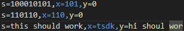

# Interweaved string detector

This Python program allows you to see if a string s is an interweaving of the strings x and y

## Requirements

Before running the program, make sure to install the required dependencies using `pip`

### Install Dependencies

```bash
pip install matplotlib
```

### How to use the program

* enter comparisons to make inside `interweavedStrings.csv` file as follows:
    * s=someString,x=sub1,y=sub2

        

    * Do not add any quotes around the string unless that is part of the string
    * Do not use Excel to edit the csv as it will add formatting that will be parsed incorrectly by the python script
    * You can add more checks by adding a new line and entering in more s, x, and y in the same format. 
    * Some values are already in the csv file as an example
* From the directory the scripts are located in, open a terminal
* run the script:
```bash
python interweave.py
```

* The terminal will output s, x, y, and if s is an interwoven string of x and y
* Once the script completes the checks from the csv file, it will run run time complexity analysis by generating s of various lengths and checking its comparison count
* A window will open graphing len(s) vs comparisons to show that the algorithm runs in O(n)